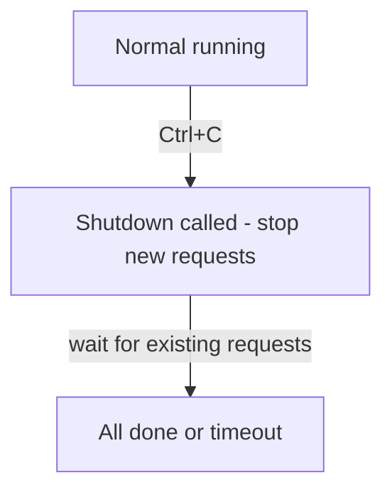

# Go > HTTP

Go's standard library includes a powerful and production-ready `net/http` package that provides everything you need to build both HTTP servers and clients. Unlike many other languages, Go doesn't require third-party frameworks like Echo, Gin, or Chi for most use cases. The standard library is advanced enough to handle routing, middleware, timeouts, graceful shutdowns, and more. While frameworks can offer convenience features, the standard library is often sufficient and keeps your dependencies minimal.

## How to Create An HTTP Server

Creating an HTTP server in Go is as simple as this:

```go
package main

import (
	"fmt"
	"net/http"
)

func main() {
	http.HandleFunc("/", handler)
	http.ListenAndServe(":8080", nil)
}

func handler(w http.ResponseWriter, r *http.Request) {
	fmt.Fprint(w, "Hello World")
}
```

By visiting `http://localhost:8080`, we can see that `Hello World` is printed on screen. The `HandleFunc` function sets up a handler function for a specific URL pattern (`/` in this case). When a request is made to the root path (`/`), the provided handler function is executed. The handler function takes two arguments: `w` is a `ResponseWriter` that allows you to construct an HTTP response, and `r` is a `Request` that contains information about the incoming request.

Notice the type signatures where `r` is `*http.Request` (a pointer), while `w` is `http.ResponseWriter` (not a pointer). This design choice is intentional. The `Request` is passed as a pointer because it's a large struct containing headers, body, URL, and other metadata, and passing it by pointer avoids copying all that data. Additionally, middleware often needs to create modified versions of the request (such as updating its context). The pointer allows efficient passing of these modified versions through the middleware chain. If the request were passed by value (non-pointer), each handler would receive its own copy, making it impossible to pass modified versions forward without expensive full-struct copying. With a pointer, we can reassign our local pointer variable to a modified request and pass it to the next handler efficiently. The `ResponseWriter`, on the other hand, is an interface (not a concrete struct). Interfaces in Go are already reference types internally, so there's no need for an explicit pointer. The interface abstraction allows Go's HTTP package to work with different response writer implementations (HTTP/1.1, HTTP/2, test recorders, etc.) without changing handler signatures.

### Middlewares

One common scenario where you need to create modified versions of the `Request` is when you're working with middleware. Middleware is a function that wraps around your handler to add cross-cutting functionality (like authentication, logging, or request modification) before or after the main handler executes. Middleware can create a new request with an updated context to pass data between layers:

```go
package main

import (
	"context"
	"fmt"
	"net/http"
)

const validApiKey = "jlkhlds8783742%klkjlfd"

type user struct {
	name string
}

func main() {
	http.HandleFunc("/", authMiddleware(handler))
	http.ListenAndServe(":8080", nil)
}

func authMiddleware(next http.HandlerFunc) http.HandlerFunc {
	return func(w http.ResponseWriter, r *http.Request) {
		apiKey := r.Header.Get("X-API-Key")
		if apiKey != validApiKey {
			http.Error(w, "Unauthorized", http.StatusUnauthorized)
			return
		}

		authenticatedUser := user{name: "John Doe"}
		r = r.WithContext(context.WithValue(r.Context(), "user", authenticatedUser))
		next(w, r)
	}
}

func handler(w http.ResponseWriter, r *http.Request) {
	authenticatedUser, ok := r.Context().Value("user").(user)
	if !ok {
		http.Error(w, "Internal Server Error", http.StatusInternalServerError)
		return
	}
	fmt.Fprintf(w, "Hello, %s! You are authenticated.", authenticatedUser.name)
}
```

In this example, the `authMiddleware` checks for the presence of the `X-API-Key` header in the request. If the header is present and has the correct value, it considers the request authenticated. It then attaches information about the authenticated user to the request context using `WithContext`.

The context (accessed via `r.Context()`) is Go's idiomatic way to pass request-scoped values, cancellation signals, and deadlines across API boundaries. The `Request` struct's fields are actually immutable in practice meaning you don't modify them directly. Instead, `r.WithContext()` creates a shallow copy of the request with an updated context (the shallow copy means expensive fields like headers and body still point to the same underlying data). We then reassign this new request to our local `r` pointer variable and pass it forward to the next handler. This is why the pointer is crucial: it allows us to efficiently pass these modified request versions through the middleware chain without copying the entire struct each time.

```sh
$ curl --location 'http://localhost:8080' --header 'X-API-Key: jlkhlds8783742%klkjlfd'
```

By sending the above curl request, we will get `Hello, John Doe! You are authenticated.` However, if we remove the custom header while sending the request like so:

```sh
$ curl --location 'http://localhost:8080'
```

We will receive an `Unauthorized` response.

### Graceful Shutdown

When you stop an HTTP server (for deployment, restart, or shutdown), you don't want to abruptly kill in-flight requests. Graceful shutdown ensures that:

1. The server stops accepting new connections
2. Existing requests are allowed to complete
3. After a timeout period, remaining connections are forcefully closed

Without graceful shutdown, clients receive connection errors, data may be lost, and database transactions could be left incomplete. Here's how to implement graceful shutdown using Go's built-in support:

```go
package main

import (
	"context"
	"fmt"
	"log"
	"net/http"
	"os"
	"os/signal"
	"syscall"
	"time"
)

func main() {
	server := &http.Server{
		Addr:    ":8080",
		Handler: http.HandlerFunc(handler),
	}

	stop := make(chan os.Signal, 1)
	signal.Notify(stop, os.Interrupt, syscall.SIGTERM)

	go func() {
		log.Println("Starting server on :8080")
		if err := server.ListenAndServe(); err != nil && err != http.ErrServerClosed {
			log.Fatalf("Server failed to start: %v", err)
		}
	}()

	<-stop
	log.Println("Shutting down server gracefully...")

	ctx, cancel := context.WithTimeout(context.Background(), 10*time.Second)
	defer cancel()

	if err := server.Shutdown(ctx); err != nil {
		log.Fatalf("Server forced to shutdown: %v", err)
	}

	log.Println("Server stopped")
}

func handler(w http.ResponseWriter, r *http.Request) {
	time.Sleep(5 * time.Second) // Simulate a long-running request
	fmt.Fprint(w, "Request completed successfully")
}
```

We use `&http.Server{}` instead of the convenience function `http.ListenAndServe()` because we need a reference to the server object to call `Shutdown()` on it later. The convenience function doesn't return a server reference, so it's only suitable for simple cases where you don't need lifecycle control. Now let's focus on the following block:

```go
stop := make(chan os.Signal, 1)
```

`make(chan os.Signal, 1)` is as if creating a mailbox where the operating system can drop a shutdown message. This channel is a pipe for sending messages which only accepts messages of type `os.Signal` which is just Go's name for "something the operating system sends to your program". The buffer size of `1` means that the mailbox can hold only one message because we only care about a shutdown happening and we don't care how many times Ctrl+C was pressed. Without this buffer, the OS could try to send a signal but get stuck if no one is listening yet. In simiple terms, it says "Hey Go, please give me a small inbox called stop that can receive one shutdown notice."

```go
signal.Notify(stop, os.Interrupt, syscall.SIGTERM)
```

On this line, when the operating system sends these signals, it asks Go not to kill our program automatically instead put them into our `stop` channel:

-   `os.Interrupt`: This is what happens when you press Ctrl+C in the terminal
-   `syscall.SIGTERM`: This is what happens when Docker stops a container or Kubernetes terminates a pod (If you are just developing locally, you can just remove this third pound, which is only suitable for production environments.)

Later in our code `<-stop` is awaiting the signal. If we use `server.ListenAndServe()` directly, It starts the server but it never returns and it blocks forever while the server is running and `<-stop` never runs! Even if we kill the program using Ctrl+C, graceful shutdown code is never reached. `server.ListenAndServe()` It's a blocking function, meaning the program stops at that line and nothing after it runs until the function exists That's why we need a Goroutine instead. When we run `go func() { }`, we are telling Go to run the code in the background and let the rest of our program keep going:

```go
go func() {
	log.Println("Starting server on :8080")
	if err := server.ListenAndServe(); err != nil && err != http.ErrServerClosed {
		log.Fatalf("Server failed to start: %v", err)
	}
}()
```

In this code, the program starts a Goroutine (a background worker or OS-like thread) starts the server, and the main function keeps running and reaches `<-stop` And our API now waits for Ctrl+C command and when it is received, the graceful shutdown runs. In other words, now both goals are achieved: server is running, shutdown logic is listening actively. Previously we mentioned that `<-stop` Is a blocking line that waits for a shutdown signal (when Ctrl+C or SIGTERM happens). In other words, it asks Go "Pause here until someone asks us to shut down."

```go
ctx, cancel := context.WithTimeout(context.Background(), 10*time.Second)
defer cancel()
```

Let's first see what problem we are solving. When we tell the server to shut down, we don't want to wait forever or to kill the requests immediately. Instead, we want to finish what the server is doing, but it shouldn't take too long. That's why we need an arbitrary time limit and a clear signal when the time is over. This is exactly what this context provides. This line creates a shutdown signal that automatically turns off after 10 seconds. Then we pass to the server on `server.Shutdown(ctx)` line which tells the server that **it should stop accepting new requests** and it has only 10 seconds to do whatever you want to do.



If the shutdown finishes on time, we don't need the timer inside the context anymore, and the `cancel()` function stops it immediately to free up resources. Now this is what the server does:

-   Stops accepting new requests
-   Waits for active requests to finish
-   Watches the context the whole time

In this scenario, if all the active requests finish in less than 10 seconds, the shutdown succeeds. But if the 10 second passes, The status of the context becomes "done" and the server returns an error. To test this, start the server and make a request:

```bash
curl http://localhost:8080
```

While the request is processing (it sleeps for 5 seconds), press Ctrl+C in the server terminal. You'll see:

-   The server receives the shutdown signal
-   The current request completes successfully
-   The server shuts down cleanly

If you press Ctrl+C with no active requests, the shutdown is immediate.

## How to Send HTTP Requests in Go?

To send an HTTP request to a remote server, use `http.NewRequest()` to create a request and `client.Do()` to execute it. This approach gives you full control over the request, allowing you to set custom headers, choose HTTP methods, and configure request-specific options:

```go
package main

import (
	"context"
	"fmt"
	"io"
	"log"
	"net/http"
	"time"
)

func main() {
	ctx, cancel := context.WithTimeout(context.Background(), 5*time.Second)
	defer cancel()

	request, err := http.NewRequestWithContext(ctx, "GET", "https://go.dev", nil)
	if err != nil {
		log.Fatal(err)
	}

	client := http.Client{}
	res, err := client.Do(request)
	if err != nil {
		log.Fatal(err)
	}
	defer res.Body.Close()

	bytes, err := io.ReadAll(res.Body)
	if err != nil {
		log.Fatal(err)
	}
	fmt.Println(string(bytes))
}
```

When you make an HTTP request in Go, `res.Body` is not the whole response already loaded in memory. Instead, it's a live stream of data coming from the server, like a pipe. The underlying TCP connection stays open so you can read the response bit by bit. Go doesn't know when you're done reading, so it leaves the connection open.

This is why you must call `res.Body.Close()` to tell Go "I'm done with this connection; you can release it or reuse it for another request." If you don't close it, the connection stays open, consuming system resources and eventually causing connection leaks that slow down your program. Using `defer res.Body.Close()` ensures the connection is always closed when your function exits, even if an error occurs while reading the body.

**Mental picture**: Think of `res.Body` like a running faucet. You can drink from it (read the data), but the water keeps flowing until you turn it off (`Close()`). If you leave it running, it wastes resources and prevents others from using the pipe.

In the example above, we use `context.WithTimeout()` to create a context with a 5-second timeout, then pass it to `http.NewRequestWithContext()`. This gives us request-level timeout control. Go actually supports two kinds of timeouts when sending HTTP requests:

**Client-level timeout** is set on `http.Client.Timeout` and acts as a global safety limit for all requests made by that client. It covers the entire request-response cycle including connecting to the server, following redirects, and reading the response body. If any request takes longer than this limit, it automatically fails. This timeout applies to every request and cannot be changed for individual requests.

**Context-level timeout** is set via `context.WithTimeout()` and passed to `http.NewRequestWithContext()`. This timeout is specific to a single request and allows you to cancel or time out that request independently of the client settings. For example, you might have a 10-second client timeout as a general safety net, while a specific request uses a 3-second context timeout to fail faster if needed.

In practice, client timeouts protect your system overall (preventing requests from hanging indefinitely), while context timeouts give you precise control over individual requests. You can use both together: the context timeout for fine-grained control, and the client timeout as a backstop.

### Client Configuration and Best Practices

For production applications, you should configure the `http.Client` with appropriate timeouts and settings. The default client has no timeout, which can cause requests to hang indefinitely:

```go
import (
	"net/http"
	"time"
)

client := &http.Client{
	Timeout: 10 * time.Second,
	Transport: &http.Transport{
		MaxIdleConns:        100,
		MaxIdleConnsPerHost: 10,
		IdleConnTimeout:     90 * time.Second,
	},
}
```

Here is what each key does:

-   **Timeout**: Sets the maximum duration for the entire request-response cycle (including connection time, redirects, and reading the response body)
-   **Connection pooling**: The `http.Client` reuses connections automatically. Creating a new client for every request defeats this optimization. Instead, create one client and reuse it
-   **MaxIdleConns**: Limits the total number of idle connections across all hosts
-   **MaxIdleConnsPerHost**: Limits idle connections to each host (prevents one host from consuming all connections)
