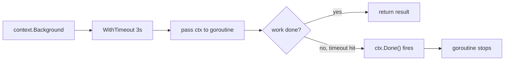

# Go > Context

The `context` package provides a way to carry deadlines, cancellation signals, and request-scoped values across API boundaries and between goroutines (functions running concurrently, like handling multiple HTTP requests at once). It's essential when you need to control the lifecycle of operations like timing out an HTTP request, canceling a database query, or stopping goroutines gracefully. This is how context works under the hood from a high level:



## Creating a Context

Before you can add timeouts or values, you need a starting point. Think of it as creating an empty container that you'll add features to later. To do that, you have two options:

-   `context.Background()` is what you'll use 99% of the time. It returns an empty context with no deadline and no values.
-   `context.TODO()` does the same thing but signals "I'm not sure what context to use here yet." It's a placeholder during development.

## Cancellation with Timeout

The most common use case is `context.WithTimeout()` which automatically cancels after a duration:

```go
package main

import (
	"context"
	"fmt"
	"time"
)

func main() {
	ctx, cancel := context.WithTimeout(context.Background(), time.Second*3)
	defer cancel()

	heavyOperation(ctx)
}

func heavyOperation(ctx context.Context) {
	select {
	case <-time.After(2 * time.Second): // Wait for work to be done
		fmt.Println("operation completed")
	case <-ctx.Done(): // Wait for cancellation
		fmt.Println("operation canceled:", ctx.Err())
	}
}
```

Let's review what we have done so far:

-   `WithTimeout` returns a new context and a `cancel` function
-   We'll do `defer cancel()` which prevents resource leaks even if the operation completes before the timeout
-   `ctx.Done()` returns a channel (a way for goroutines to communicate with each other) that closes when the context is canceled
-   `ctx.Err()` tells you what happened behind the scenes

If we change the timeout to 1 second (shorter than the 2-second operation), the output becomes:

```text
operation canceled: context deadline exceeded
```

Now we need to discuss why we used the `select` pattern. Basically, blocking calls like `time.Sleep()` cannot be canceled directly. The `select` statement solves this by listening to multiple channels simultaneously. Think of it like waiting at a bus stop where two buses could arrive: either "work completed" or "timeout happened." The `select` waits for whichever comes first and responds to it:

```go
select {
case <-time.After(2 * time.Second):
	fmt.Println("operation completed")
case <-ctx.Done():
	fmt.Println("operation canceled:", ctx.Err())
}
```

As we said before, the `select` responds to whichever happens first. For incremental work, use this pattern:

```go
package main

import (
	"context"
	"fmt"
	"time"
)

func main() {
	ctx, cancel := context.WithTimeout(context.Background(), time.Second*3)
	defer cancel()

	processChunks(ctx)
}

func processChunks(ctx context.Context) {
	for i := 1; i <= 10; i++ {
		select {
		case <-ctx.Done():
			fmt.Println("stopped early:", ctx.Err())
			return
		default:
			fmt.Printf("processing chunk %d\n", i)
			time.Sleep(500 * time.Millisecond)
		}
	}
	fmt.Println("all chunks completed")
}
```

In this example, we have 10 chunks of work, each taking 500 milliseconds (5 seconds total). But the context times out after 3 seconds. On each iteration, the `select` checks if `ctx.Done()` has fired. If not, it falls through to `default` and processes the next chunk. Around chunk 6, the timeout hits, `ctx.Done()` closes, and the function exits early. If you increase the timeout to 6 seconds, all 10 chunks will complete.

## Passing Values

`context.WithValue()` attaches request-scoped data to a context. Use a custom type for keys to avoid collisions:

```go
package main

import (
	"context"
	"fmt"
)

type ctxKey string

const userKey ctxKey = "user"

func main() {
	ctx := context.Background()
	ctx = context.WithValue(ctx, userKey, "john doe")

	greetUser(ctx)
}

func greetUser(ctx context.Context) {
	username, ok := ctx.Value(userKey).(string)
	if !ok {
		fmt.Println("no user found")
		return
	}
	fmt.Printf("hello, %s\n", username)
}
```

Keep in mind to use this feature sparingly; context values should be request-scoped data (like request IDs, auth tokens), not a way to pass function parameters.

## Links

-   https://pkg.go.dev/context
-   https://go.dev/blog/context
